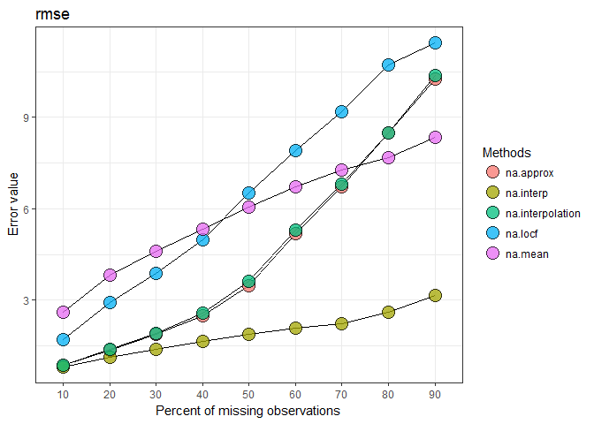

## imputeTestbench

#### *Neeraj Bokde, neerajdhanraj@gmail.com, Marcus W. Beck, beck.marcus@epa.gov*

[](https://travis-ci.org/fawda123/imputeTestbench)

[](https://ci.appveyor.com/project/fawda123/imputeTestbench)

[](https://CRAN.R-project.org/package=imputeTestbench)


This is the development repository for the imputeTestbench package.  This package provides a testbench for comparing imputation methods for missing data in univariate time series. 

The development version of this package can be installed from GitHub:


```r
install.packages('devtools')
library(devtools)
install_github('neerajdhanraj/imputeTestbench', ref = 'development')
```

The current release can be installed from CRAN:


```r
install.packages('imputeTestbench')
```

#### Basic use

The core function is `impute_errors()`.  See the help documentation for more details.


```r
library(imputeTestbench)
a <- impute_errors(data = nottem)
a
```

```
## $Parameter
## [1] "rmse"
## 
## $MissingPercent
## [1] 10 20 30 40 50 60 70 80 90
## 
## $na.approx
## [1]  0.9307714  1.4503932  1.8461202  2.5656419  3.6165535  4.8808955
## [7]  6.3838188  8.5943155 10.1325342
## 
## $na.interp
## [1] 0.8084972 1.1176487 1.3867667 1.6482180 1.8478308 2.0775023 2.2887840
## [8] 2.5651139 3.1129750
## 
## $na.interpolation
## [1]  0.935737  1.460501  1.860259  2.708473  3.642403  4.887642  6.529692
## [8]  8.668559 10.216941
## 
## $na.locf
## [1]  1.706314  2.826062  4.036215  4.888672  6.044398  7.665749  9.258763
## [8] 10.518536 11.595488
## 
## $na.mean
## [1] 2.730135 3.819668 4.648261 5.462469 6.123465 6.609261 7.256209 7.802480
## [9] 8.256238
```

```r
plot_errors(a, plotType = 'line')
```

<!-- -->

#### Citation

Neeraj Bokde and Marcus W. Beck (2016). imputeTestbench: Test Bench for the comparison of imputation methods. R package version 3.0. http://www.neerajbokde.com/cran/imputetestbench

#### Bug reports 

Please submit any bug reports (or suggestions) using the [issues](https://github.com/neerajdhanraj/imputeTestbench/issues) tab of the GitHub page.

#### License

This package is released in the public domain under the creative commons license CC0.
